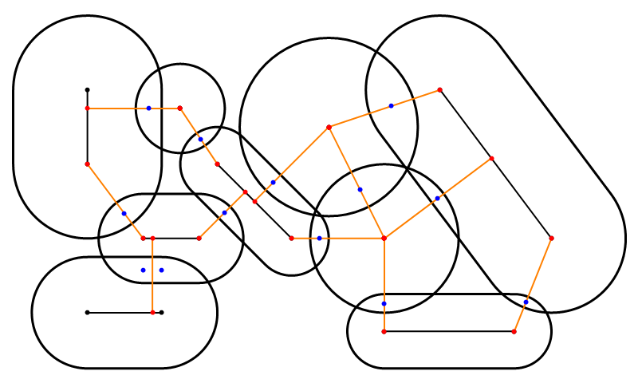
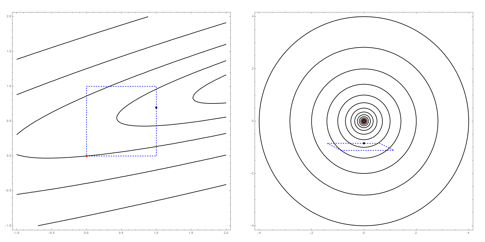

# Capsule vs Capsule Contact Manifold Generation (minimization problem + QR factorization)

## Description
A method based on QR factorization for performing minimum distance and closest point calculations for line-segments / capsules.

## References
* distance query between line-segments - "Efficient Calculation of Minimum Distance Between Capsules and Its Use in Robotics" by Mohammad Safeea, Pedro Neto, Richard Bearee
* contact manifold structure - [Box2D-Lite](https://github.com/erincatto/box2d-lite) by Erin Catto
